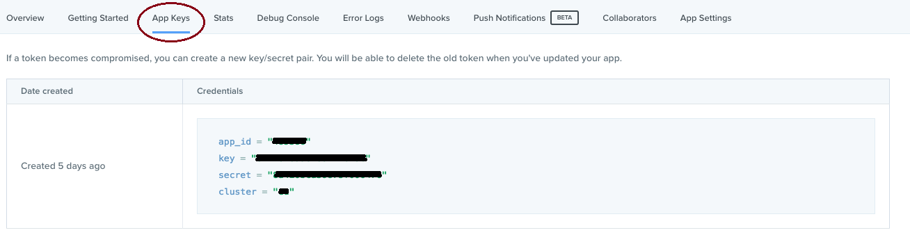
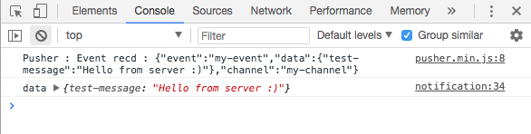

# NotificationsBundle

A simple implementation for [Pusher](https://pusher.com/) API that helps you integrate a notifications
system in a few simple steps.

# Installation

1. `composer require mrad/notifications-bundle`<br>
2. Enable the bundle in AppKernel.php `new SBC\NotificationsBundle\NotificationsBundle(),`<br>

# Usage

### Step 1:
First thing you need to create an [account](https://pusher.com/signup) with **Pusher** and then in **Your apps** menu create
a new app.

### Step 2:
Add you app configuration to the `app/config.yml`:
```
# NotificationsBundle configuration
notifications:
    app_id:     your_id
    app_key:    your_key
    app_secret: secret
    cluster:    cluster
    # Optional
    # Default false: work without ssl encryption
    # Set it to true to work with ssl encryption
    encrypted:  false
```
Of course you can find those details in your app in the dashboard.<br>


### Step 3:
Now in your `view.html.twig` (your client side) add this:
```
{# Call NotificationsBundles's assets #}
{{ notifications_assets() }}
<script>
    /**
    * After calling notifications_assets() "pusher" is now available
    * and you can use it this way
    */

    // select the channel you want to listen to
    var channel = pusher.subscribe("notifications");// notifications channel
    channel.bind("my-event", function(data) {
        console.log('from notifications channel', data);
    });

    var channel = pusher.subscribe("messages");// messages channel
    channel.bind("my-event", function(data) {
        console.log('from messages channel', data);
    });
</script>
```

And that's it :smiley:, now to make sure that your client is receiving the data correctly you can test it by calling this
console command:<br>
`php bin/console notifications:trigger "Your message" "channel"`<br>
If you open the browser's console you should see something like this:<br>


### Broadcast custom messages from Backend
To broadcast messages from your backend you can simply do this:
```php
// From your controller or service
$data = array(
    'my-message' => "My custom message",
);
$pusher = $this->get('mrad.pusher.notificaitons');
$channel = 'messages';
$pusher->trigger($data, $channel);

// or you can keep the channel pram empty and will be broadcasted on "notifications" channel by default
$pusher->trigger($data);
```

### Next Step

Now I will show how to create and save notifications in database.
* [Create and persist notifications](Resources/docs/NotificationExample.md)

### License
This project is under the [MIT license](LICENSE)

### Videos
You can check this [playlist](https://www.youtube.com/watch?v=ajKTAfr1yVI&list=PLjv8CqUmMuKw9AsRL2dQH-JjQaFaIofL2) for more details about how This bundle works.

### Thanks
Thanks to [SlimenTN](https://github.com/SlimenTN) for his help in this project